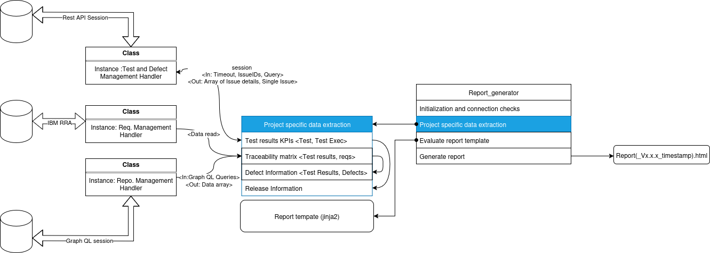

## Automated Project Compliance and Report Generation Handlers
The aim of this project is to provide a set of modular and reusable API handler libraries that enable seamless integration and management of projects running on popular CI/CD platforms.
This objective of this project is to provide a solution for developers to update the necessary data for ASPICE assessments during the implementation, also automating the reports with compliance.
Imagine a situation when developer need not spend time on process compliance but just do it as they progress on the work!!

A general architecture of the project - as follows:
<p align="center">
  
</p>

The entire project is demonstrated by two sections.
### Section 1:
In this section samples of metadata produced by the config management tools are included by the structure
```bash
.
├── data
│   ├── releases
│   │   └── release_info.json
│   ├── requirement_data
│   │   ├── component_metadata.json
│   │   ├── Interfaces_metadata.json
│   │   ├── SW_requirements_metadata.json
│   │   └── Unit_spec_meta_data.json
│   ├── test_case_data
│   │   ├── component_tests.json
│   │   ├── integration_tests.json
│   │   ├── interface_tests.json
│   │   ├── sw_requirements_tests.json
│   │   └── unit_tests.json
│   └── test_execution_data
│       ├── release_001.json
│       └── release_002.json
├── project_utilities 
│   └── sample_reporting_system.py
└── report_templates
    ├── report_template.html
    └── test_report_example.html
```
The folder contains metadata created for this project and is not replicated from any existing source. Ideally the data is expected to created by data collectors (E.g. REST API calls) on specific time intervals such that the infrastructure is not overloaded and criticallity of the data.

The report template has the jinja2 template of the resultant html and an example of the report [To Download](https://github.com/ManiRajan1/Project_repositories/blob/PM_Rest_API_handler/report_templates/test_report_example.html)

### Section 2: 

These handlers are designed to interact with services like issue trackers (e.g., JIRA), documentation platforms (e.g., Confluence), and source control tools (e.g. GitLab), allowing for automated retrieval, processing, and analysis of project data.

In addition these API wrappers are created such that the API requests donot stress the infrastructure and aid to generate automated reports — such as test execution summaries, pipeline statuses, and release notes — to support continuous monitoring, traceability, and decision-making in DevOps workflows.

The project_utilities includes a data collector that creates 
    - traceability matrix 
    - defect matrix
    - test execution classified by necessary fields
    - A general overview of the project report

The related files are as below:
``` bash
.
├── libs
│   ├── Confluence_handler.py
│   ├── Gitlab_handler.py
│   ├── Jira_handler.py
│   └── Xray_handler.py
└── project_utilities
    └── project_specific_data_collector.py
```

The code repository of interest can be viewed by [PM_Compliance_handlers](https://github.com/ManiRajan1/Project_repositories/tree/PM_Rest_API_handler) 

In order to run the tool to extract a report based on your metadata:
Replace your metadata into the files from *_./data_* and run the below commands in a bash shell.

``` bash
#!/bin/bash
git clone https://github.com/ManiRajan1/Project_repositories.git
cd Project_repositories/
git fetch origin PM_Compliance_handler:PM_Compliance_handler
git checkout PM_Compliance_handler
python3 -m venv .venv
source .venv/bin/activate
python3 -m pip install -r requirements.txt
python3 ./project_utilities/sample_reporting_system.py
``` 
