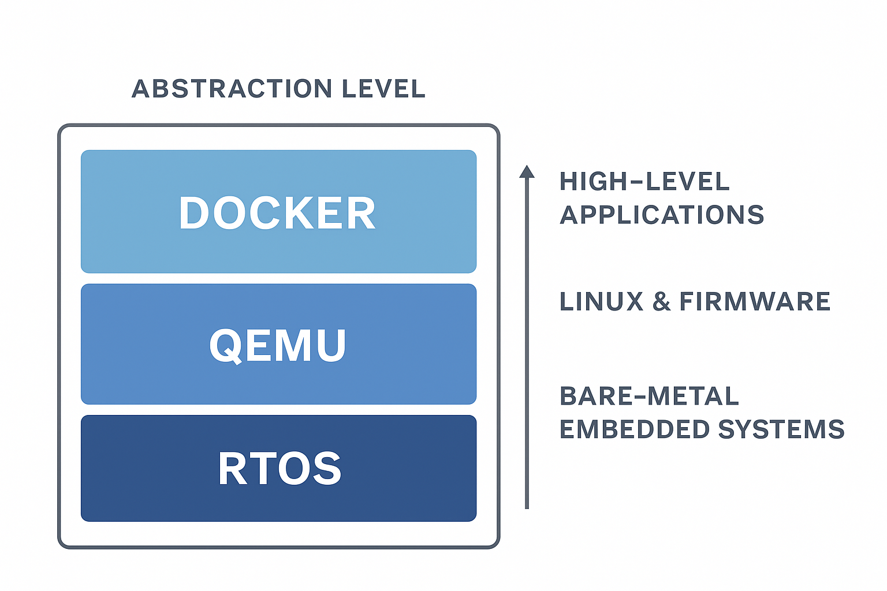

## Virtual HIL testing

In automotive software development, testing embedded applications like CAN-based signal processing, UDS diagnostics, and XCP variable access often depends heavily on physical ECUs and test benches. This creates bottlenecks, increases costs, and slows down development.

This project introduces a virtual test framework using Docker, QEMU, and RTOS simulators to emulate ARM-based control units and their communication behavior — without needing real hardware.

**Key Benefits**:
+ Faster Testing Cycles: Run tests early and often, even before hardware is ready.
+ Lower Costs: Reduce reliance on expensive hardware rigs for basic verification.
+ Flexible Abstraction: Simulate at multiple levels — from high-level Linux apps to bare-metal RTOS — to match specific testing needs.
+ Better Debugging: Simulate edge cases and protocol errors in a controlled environment.
+ Scalable: Easily integrates with CI/CD pipelines for continuous validation.

This approach helps engineering teams deliver higher-quality automotive software faster, while ensuring compliance with standards like ISO 26262 and AUTOSAR communication protocols.



## Strategy 

The solutions are classified into four branches:

+ The Base Branch which is [Virtual_HIL_testing]() holds shared infrastructure, documentation, and interfaces (e.g., CAN, UDS config definitions).

+ Feature Branches - Each branch focuses on one solution and contains the relevant tooling, Dockerfiles, QEMU configs, or RTOS simulators.

  + [Virtual_HIL_testing_Docker](https://github.com/ManiRajan1/Project_repositories/blob/Virtual_HIL_testing_Docker/docs/README.Virtual_HIL_testing_Docker.md) :	Simulate high-level Linux application in a Docker container
  + [Virtual_HIL_testing_QEMU_Linux](https://github.com/ManiRajan1/Project_repositories/blob/Virtual_HIL_testing_QEMU/docs/README.Virtual_HIL_testing_QEMU.md) : Emulate an ARM-based Linux target via QEMU inside Docker or standalone
  + [Virtual_HIL_testing_QEMU_Bare](https://github.com/ManiRajan1/Project_repositories/blob/Virtual_HIL_testing_bare/docs/README.Virtual_HIL_testing_bare.md) : Use QEMU to emulate ARM (with limited Linux or bare-metal configs)
  + [Virtual_HIL_testing_RTOS](https://github.com/ManiRajan1/Project_repositories/blob/Virtual_HIL_testing_RTOS/docs/README.Virtual_HIL_testing_RTOS.md)	Use a bare-metal RTOS simulator like Renode or Keil for precision tests

The folder structure is followed as below:
```bash
Virtual_HIL_testing/
│
├── docs/                      # Shared documentation across all branches
│   └── README.md              # High-level overview (updated per branch if needed)
│
├── common/                   # Shared configs (e.g., CAN DBC, UDS profiles, test cases)
│   ├── can_defs/
│   ├── uds_profiles/
│   └── xcp_variables/
│
├── simulation/               # Simulation-specific content (varies by branch)
│   └── docker/               # Only in docker-linux branch
│
│   └── qemu/                 # Only in qemu-linux and qemu-bare branches
│
│   └── rtos_sim/             # Only in rtos-sim branch
│
├── tests/
│   ├── integration/
│   ├── protocol_validation/
│   └── reports/
│
└── .gitlab-ci.yml / .github/ # Shared CI config (or custom per branch if needed)
```
