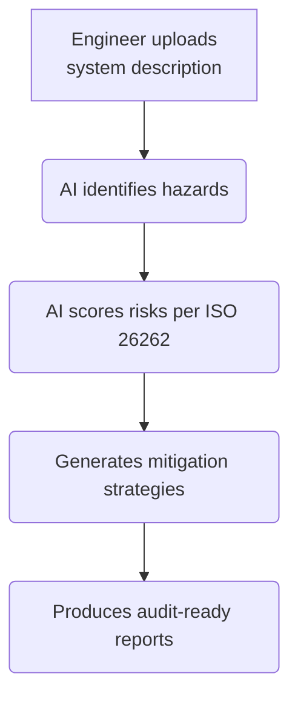

# AI-Assisted HARA Workflow :robot: 

--

**Modular Hazard Analysis and Risk Assessment (HARA) system with AI support**

## :car: **Business Value Proposition**
**Accelerates ISO 26262 compliance** for automotive/industrial systems by automating safety analysis while maintaining rigorous audit standards.

## :gear: **How It Works**

## :chart_with_upwards_trend: **Key Benefits**
+ Time
    - 50-70% faster than manual HAZOP/FMEA sessions
    - Instant report generation vs. weeks of documentation

+ Risk Mitigation
    - Pre-validated templates reduce human error
    - Auto-generated traceability simplifies audits

## :warning: Governance Controls
+ Human-in-the-loop: All AI outputs require engineer sign-off
+ Version tracking: Full history of modifications
+ Audit mode: Export all decision rationales

## :computer: Technical Requirements
+ Runs on existing n8n instances
+ Docker deployment (<1hr setup)
+ Integrates with JAMA/DOORS (optional)

