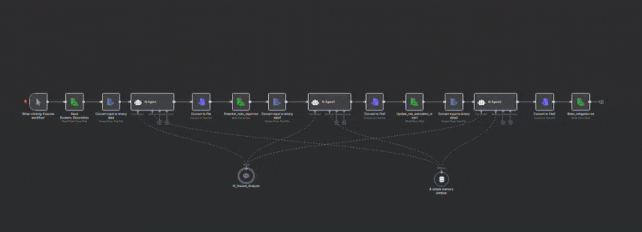
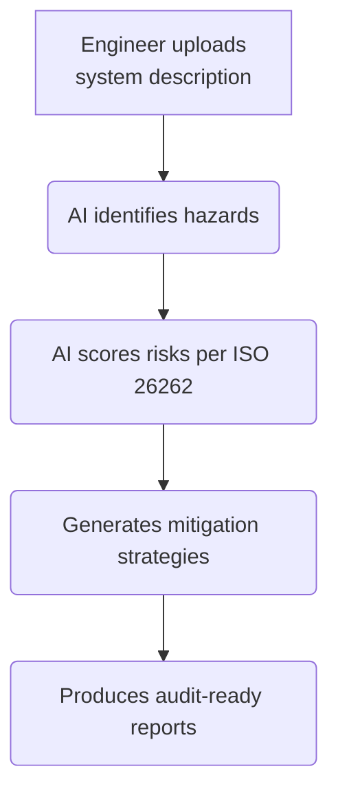

# AI-Assisted HARA Workflow :robot: [](../LICENSE)

**Modular Hazard Analysis and Risk Assessment (HARA) system with AI support**


## :car: **Business Value Proposition**
**Accelerates ISO 26262 compliance** for automotive/industrial systems by automating safety analysis while maintaining rigorous audit standards.

## :gear: **How It Works**


## :chart_with_upwards_trend: **Key Benefits**
+ Time
    - 50-70% faster than manual HAZOP/FMEA sessions
    - Instant report generation vs. weeks of documentation

+ Risk Mitigation
    - Pre-validated templates reduce human error
    - Auto-generated traceability simplifies audits


## :warning: Governance Controls
+ Human-in-the-loop: All AI outputs require engineer sign-off
+ Version tracking: Full history of modifications
+ Audit mode: Export all decision rationales

## :computer: Technical Requirements
+ Runs on existing n8n instances
+ Docker deployment (<1hr setup)
+ Integrates with JAMA/DOORS (optional)


## :wrench: Setup and Usage

### Prerequisites
- Docker ([Install Guide](https://docs.docker.com/engine/install/))
- Docker Compose ([Install Guide](https://docs.docker.com/compose/install/))
- n8n instance ([Free Self-Hosted](https://docs.n8n.io/hosting/installation/server-setups/docker-compose/) or [Cloud - Paid](https://n8n.io/cloud/))
- OpenAI API key ([Get Key](https://platform.openai.com/api-keys))

Enterprise-ready deployment: When supported by IT infrastructure teams, this solution transforms into a scalable AI safety assistant, providing real-time HARA guidance akin to engineering Co-pilot tools.


### :arrow_down: Installation
```bash
# 1. Clone repository
git clone https://github.com/ManiRajan1/Project_repositories.git
git switch AI_Assisted_HARA

# 2. Configure environment
cd Project_repositories
cp env .env
nano .env  # Add your OpenAI API key

# 3. Launch
sudo chmod +x ./startup.sh
sudo chmod +x ./cleanup.sh
./startup.sh

# 4. clean up
./cleanup.sh [OPTION]
# cleanup.sh — manage n8n docker-compose project
# Usage: ./cleanup.sh [option]
# Options:
#   stop    — stops the containers (keeps state)
#   down    — stops and removes containers (keeps volumes)
#   reset   — full cleanup: removes containers + volumes
```

### :play_or_pause_button: Running the Workflow

1. **Add System Description**
Update the system description file. You can follow the template provided or it can be as simple as
``` bash
echo "ADAS Braking System" > n8n/data/inputs/1_hazard_identification/systems_description.txt
```
Note: A detailed description as provided in the [setup](../n8n/data/inputs/1_hazard_identification/systems_description.txt) can provide results without model hallucinations.

2. **Access n8n UI**
- Open http://localhost:5678 in browser. Provided your using images such as `traefik` to include a certificate or any other form of encryption, kindly forward the port and update `/etc/hosts` for a linux environment.

3. **Upload workflow:**
- Trigger manually or via webhook
- Monitor progress in n8n dashboard

4. :open_file_folder: Output files

Please find the sample logs as stated below.

| Analysis Step       | Output Location                          | Sample File Name Format                  | Contents Example                          |
|---------------------|-----------------------------------------|------------------------------------------|-------------------------------------------|
| **Hazard ID**       | `n8n/data/outputs/1_hazard_identification/` | `Report_Hazard_Identification_<timestamp>.txt` | List of potential hazards with root causes |
| **Risk Estimation** | `n8n/data/outputs/2_risk_estimation/`      | `Report_Risk_Estimation_<timestamp>.txt`     | S/E/C ratings and ASIL classifications    |
| **Mitigation**      | `n8n/data/outputs/3_mitigation_strategy/`  | `Report_Mitigation_<timestamp>.txt`          | Technical/process controls with ISO links |

## :file_folder: Repository structure


## :file_folder: Repository Structure
``` bash
├── ai_models/ # Custom model training data
├── docker-compose.yml # Production-ready setup
├── n8n/
│ ├── data/ # Persistent storage
│ │ ├── inputs/ # System descriptions
│ │ └── outputs/ # Generated reports
│ └── workflows/ # n8n JSON workflows
└── docs/ # Technical specifications
```

## :handshake: Open Collaborations
I welcome integrations with:
+ Requirements management tools (Jama, DOORS)
+ Simulation platforms (ANSYS, Simulink)
+ Safety databases (ISO 26262, MIL-STD-882)
+ Addressing any gaps observed in workflow

Contribution Guide:
+ Fork the repository
+ Add your integration module in ai_models/ or n8n/workflows/
+ Submit PR with documentation in docs/

## Full version
The github project includes only the workflow of hazard analysis. However, you can purchase the complete version with the prompts and report templates as stated below

### :euro: Purchase Full Version
+ Get the paid version complete workflow:
+ Download pre-configured package from github
+ Copy n8n/workflows/Full_HARA.json to your instance

### :page_facing_up: Sample Reports
Module	Output File
[Hazard ID](../n8n/data/outputs/1_hazard_identification)
[Risk Estimation](../n8n/data/outputs/2_risk_estimation)
[Risk mitigation with traceability information](../n8n/data/outputs/3_mitigation_strategy/)

### :email: Contact
For collaboration proposals or security issues, contact me by [Email](gopalakrishnan.manirajan@gmail.com).


## Warning:warning: Validation & Limitations

### **AI-Assisted Analysis Considerations**
| Advantage | Mitigation Strategy | Implementation Example |
|-----------|---------------------|------------------------|
| Rapid hazard identification | Human validation layer | Manual review nodes in workflow |
| Consistent S/E/C scoring | Rule-based validation | ASIL-D → Redundancy check |
| Edge case coverage | Cross-reference with historical data | Integration with incident databases |

### **Critical Validation Steps**
1. **AI Output Review node in n8n**  
Example: (by code)
   ```json
   {
     "type": "function",
     "parameters": {
       "functionCode": "if ($input.item.json.ASIL === 'D' && !$input.item.json.redundancy) throw new Error('ASIL D requires redundancy');"
     }
   }

2. **Version Control**
+ Prompt versions tied to ISO standard editions (e.g., ISO26262:2018-v1.2)
+ Git-tracked changes to ai_models/training_data/

3. **Audit trails**
+ Providing a log structure for audit trails
``` bash
# Log structure
/logs/
├── YYYY-MM-DD/
│   ├── hazards_approved.log
│   └── hazards_rejected.log
```