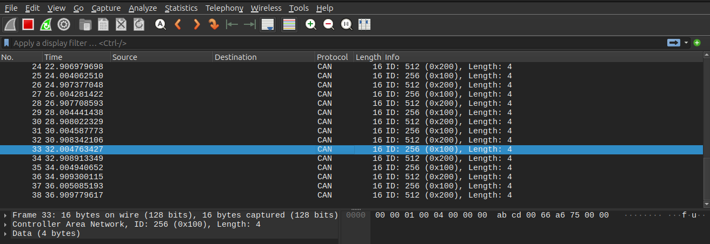

## Virtual HIL testing by Docker

This branch provides a demonstration of simulating a CAN network for a HIL simulation using Docker images. This is purely a virtual HIL simulation.

Many embedded simulations rely on network interfaces. The Linux kernel treats CAN like a network layer, and to simulate it virtually, we need to load the corresponding driver module — in this case, vcan.

**modprobe vcan**: This loads the vcan kernel module, enabling a virtual CAN interface — similar to configuring a restbus simulation in CANoe, but done via kernel-space in Linux. The lower layers of simulation are handled by vcan

**ip link add dev vcan0 type vcan**: Sets up the simulated CAN channel (vcan0).

**cansend, candump**: Equivalent to CANoe generator and trace windows for sending and capturing frames.

This is basically like creating a minimal, scriptable CAN simulation testbench using only open-source tools and no licensing restrictions.

The code repository of interest can be viewed by [Minimal setup to virtualize CAN bus-simulation](https://github.com/ManiRajan1/Project_repositories/tree/Virtual_HIL_testing_Docker)

In order to run the PoC, run the following commands on git bash

**Pre-requisities**
+ Docker-compose
+ Checks on bash
  ```bash
  sudo apt update
  sudo apt install can-utils
  sudo apt install iproute2   # in case it's missing
  ```
+ Once installed, run the check below
  ```bash
  sudo modprobe   # ✅ should work without extra installs
  sudo ip link add dev vcan0 type vcan
  sudo ip link set up vcan0
  candump vcan0   # starts logging
  cansend vcan0 123#0FF0F00F  # sends a frame
  ```
**Getting started**

Once the above checks are successful, you can clone and use the repo as below

``` bash
#!/bin/bash
git clone https://github.com/ManiRajan1/Project_repositories.git
cd Project_repositories/
git fetch origin Virtual_HIL_testing_Docker:Virtual_HIL_testing_Docker
git checkout Virtual_HIL_testing_Docker
python3 -m venv .venv
source .venv/bin/activate 
python3 -m pip3 install -r requirements.txt
sudo apt install -Y wireshark
sudo ./simulation/Docker/can_simulator.sh
``` 
Considering there is gcc preinstalled, run the following commands

**Terminal1**
``` bash
gcc -o simulation/simulator_ECU1/can_sim_ECU1.out simulation/simulator_ECU1/can_sim_ECU1.c
./simulation/simulator_ECU1/can_sim_ECU1.out 
```
**Terminal2**
``` bash
python3 ./simulation/simulator_ECU2/can_sim_ECU2.py 
```

The transmitted and received data are shown in both the terminals. This can be coupled with a stream of modelled data to simulate a HIL test bench.

The data can also be visualized quickly by network protocol analyzers like Wireshark.

``` bash
sudo wireshark
```


On clicking vcan0, the data can be monitored




For queries : raise an [Issue](https://github.com/ManiRajan1/Project_repositories/issues) with the identification of the branch 


## References
+ [SocketCAN -can.txt](https://www.kernel.org/doc/Documentation/networking/can.txt)
+ [Python-CAN](https://python-can.readthedocs.io/en/stable/bus.html)
+ [Virtual CAN](https://netmodule-linux.readthedocs.io/en/latest/howto/can.html)
+ [Cisco dump from WireShark](https://www.wireshark.org/docs/man-pages/ciscodump.html)

## Improvements
+ A single docker compose services stack that sets up and orchestrates the complete setup for a developer to start testing on one-click
+ A documentation demonstrating the usage of the tool.

